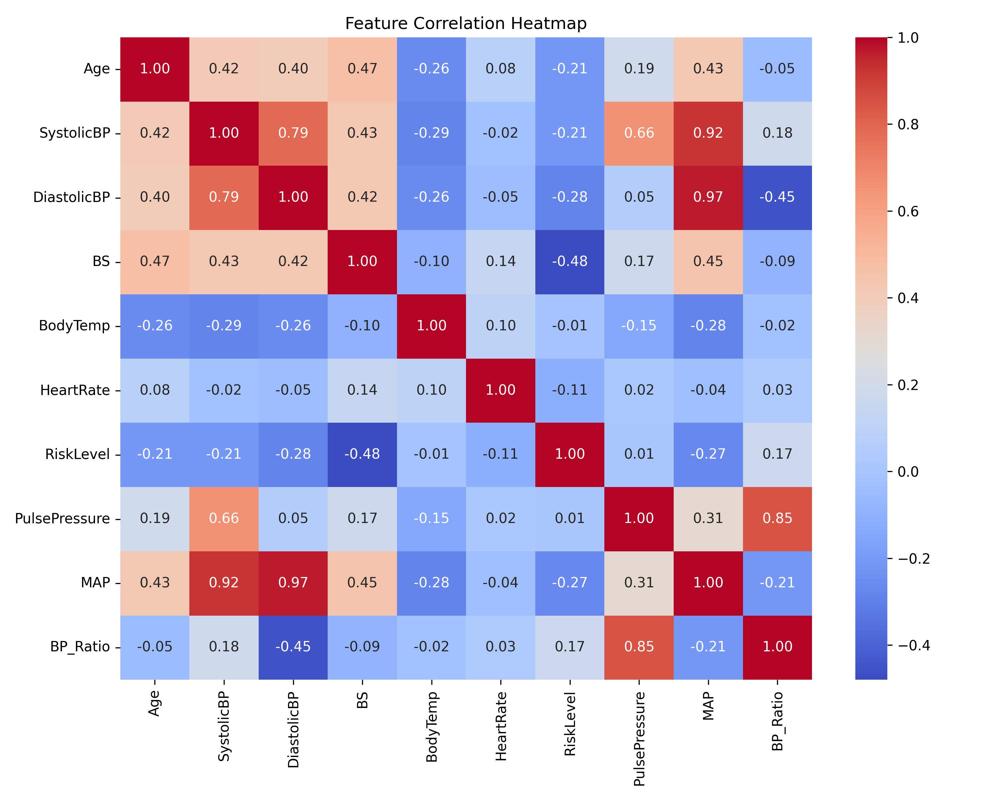
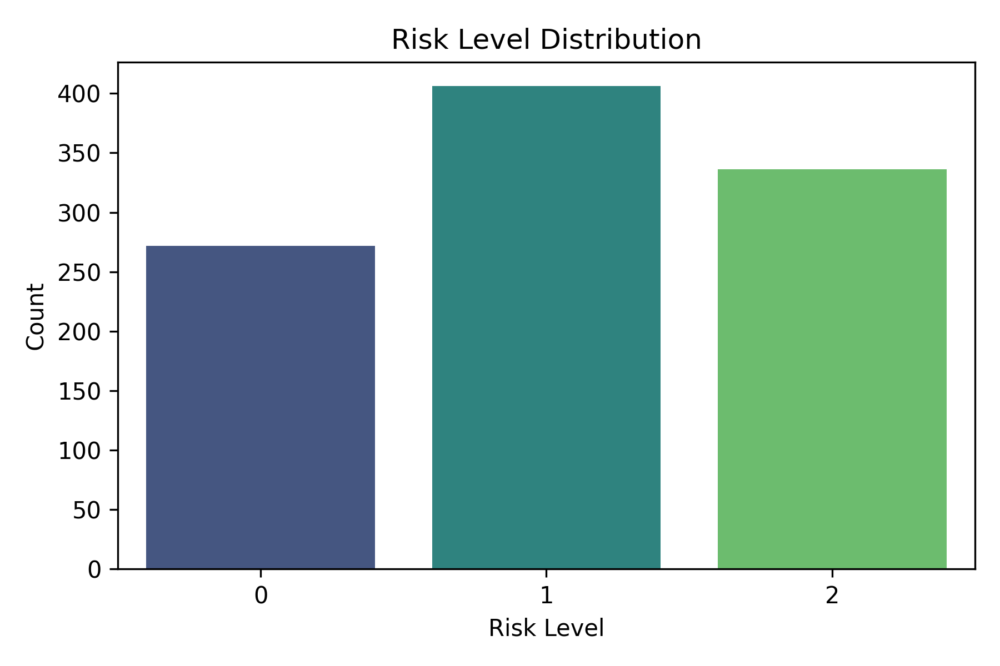
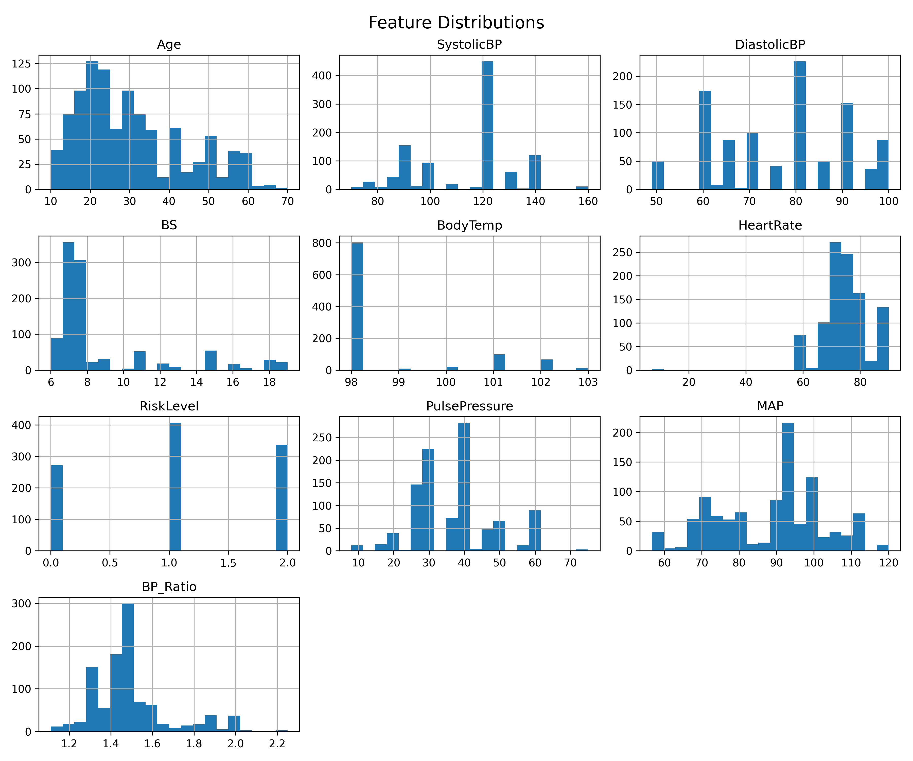
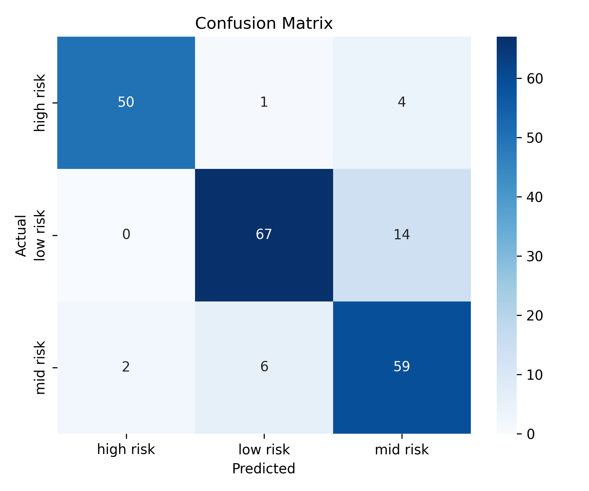

# 🧠 Maternal Health Risk Prediction System

### *AI-Powered Clinical Decision Support for Pregnancy Risk Assessment*

---

## 🚀 Overview

This project presents an **AI-powered maternal health risk prediction system** that analyzes key physiological parameters to classify pregnancy risk into **Low, Mid, or High Risk** categories.

The system integrates:

* 🤖 Machine Learning (XGBoost)
* 🧠 Explainable AI (SHAP)
* 🌐 Interactive Web Application (Streamlit)
* 📄 Clinical Report Generation (PDF)

👉 Designed as a **clinical decision support tool** for early risk detection and intervention.

---

## 🎯 Key Features

* ✅ Multi-class Risk Prediction (Low / Mid / High)
* 📊 High-risk detection optimization (clinical priority)
* 🧠 Explainable AI (SHAP-based feature impact)
* 🩺 Clinical Recommendation System
* 📈 Confidence Score Interpretation
* 📄 Downloadable Medical Report (PDF)
* 🎨 Premium UI (Healthcare-focused design)
* 🌐 Live Web Application Deployment

---

## 🧬 Dataset Information

* 📍 Source: Kaggle Maternal Health Dataset

* 📊 Features Used:

  * Age
  * Systolic Blood Pressure
  * Diastolic Blood Pressure
  * Blood Sugar
  * Body Temperature
  * Heart Rate

* ⚙️ Engineered Features:

  * Pulse Pressure
  * Mean Arterial Pressure (MAP)
  * Blood Pressure Ratio

---

## 🧠 Machine Learning Pipeline

* 🔹 Model: **XGBoost Classifier**
* 🔹 Preprocessing:

  * Label Encoding
  * Standard Scaling
  * SMOTE (for class imbalance)
* 🔹 Validation:

  * Stratified Train-Test Split
  * Cross-validation

---

## 📊 Model Performance

| Metric           | Value       |
| ---------------- | ----------- |
| Accuracy         | **86.7%**   |
| Macro F1 Score   | **0.82**    |
| High Risk Recall | **0.88 🔥** |

> ⚠️ The model prioritizes **high-risk detection**, which is critical in healthcare applications.

---

## 📈 Visualizations

### 🔹 Correlation Heatmap



---

### 🔹 Class Distribution



---

### 🔹 Feature Distribution



---

### 🔹 Confusion Matrix



---

## 🧠 Explainable AI (SHAP)

The system uses **SHAP (SHapley Additive exPlanations)** to:

* Identify feature contributions
* Explain predictions at individual level
* Improve transparency and trust

---

## 🩺 Clinical Decision Support

The system provides:

* 📌 Risk Level Prediction
* 📊 Confidence Score
* 🧠 AI Explanation
* 🩺 Clinical Recommendation
* ⚠️ Urgency Level

👉 Making it more than just a prediction model — a **decision support system**

---

## 🌐 Web Application

Built using **Streamlit** with:

* Modern UI/UX
* Responsive layout
* Real-time prediction
* Interactive inputs
* PDF report generation

---

## 📄 Sample Output

* Risk Level
* Confidence (%)
* AI Explanation
* Clinical Recommendation
* Timestamp
* Patient Data Summary

---

## 🛠️ Tech Stack

* Python
* Scikit-learn
* XGBoost
* SHAP
* Streamlit
* Pandas, NumPy
* Matplotlib, Seaborn
* ReportLab

---

## ⚙️ Project Structure

```
maternal-health-risk/
│
├── app/                # Streamlit app
├── src/                # Model & visualization code
├── data/               # Dataset
├── models/             # Trained model files
├── outputs/            # Graphs & plots
├── requirements.txt
├── README.md
├── LICENSE
```

---

## 🚀 Deployment

The application is deployed using **Streamlit Cloud**:

👉 Accessible via web for real-time predictions

---

## 📌 Future Enhancements

* Integration with IoT health devices
* Mobile application
* Larger real-world datasets
* Deep learning models
* Hospital system integration

---

## 📜 License

This project is licensed under the **MIT License**.

---

## 👨‍💻 Author

**Shree**
AI/ML Developer

---

## ⭐ If you found this useful

Give it a ⭐ on GitHub and support the project!
